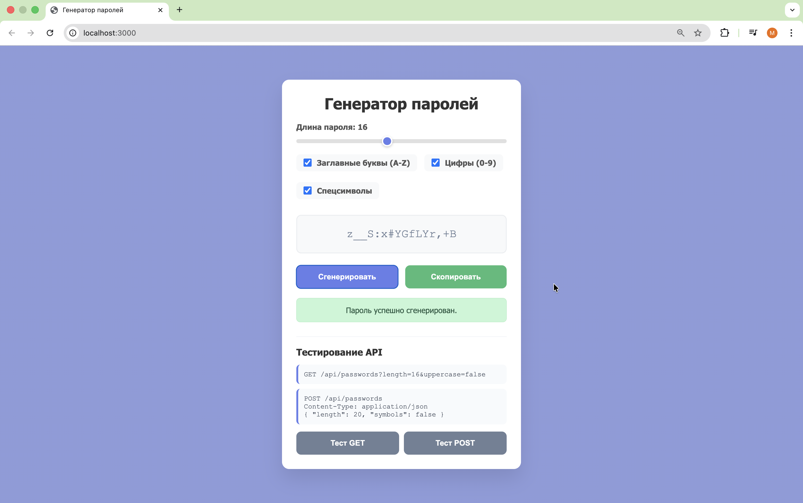
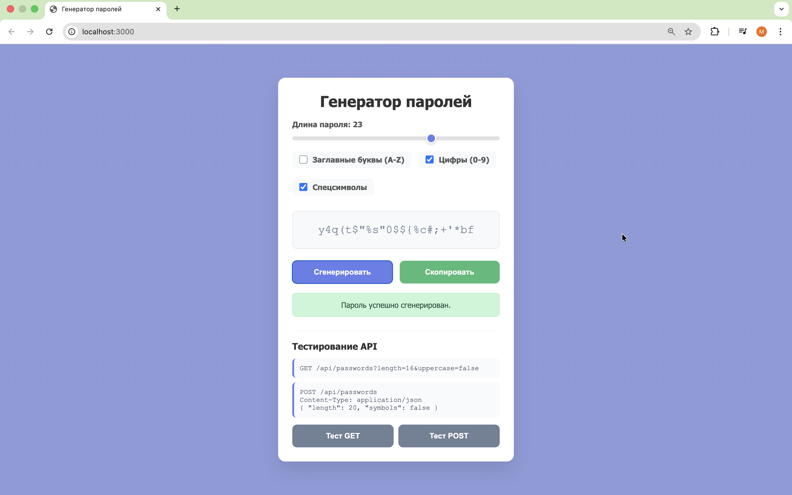
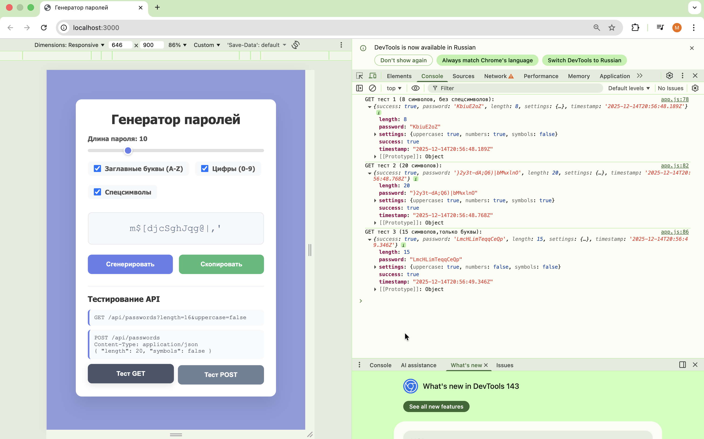

## Генератор паролей

# Описание приложения
Генератор паролей создает случайные пароли с настраиваемыми параметрами. При нажатии кнопки «Сгенерировать» система создает пароль заданной длины. При нажатии кнопки «Скопировать» пароль копируется в буфер обмена.

Приложение создает пароль с указанными характеристиками. Можно задать длину пароля от 4 до 32 и выбрать, какие типы символов должны входить в пароль. Пароль всегда содержит строчные буквы. Можно дополнительно выбрать заглавные буквы, цифры и специальные символы.

# Скриншоты
1. 
2. 
3. 